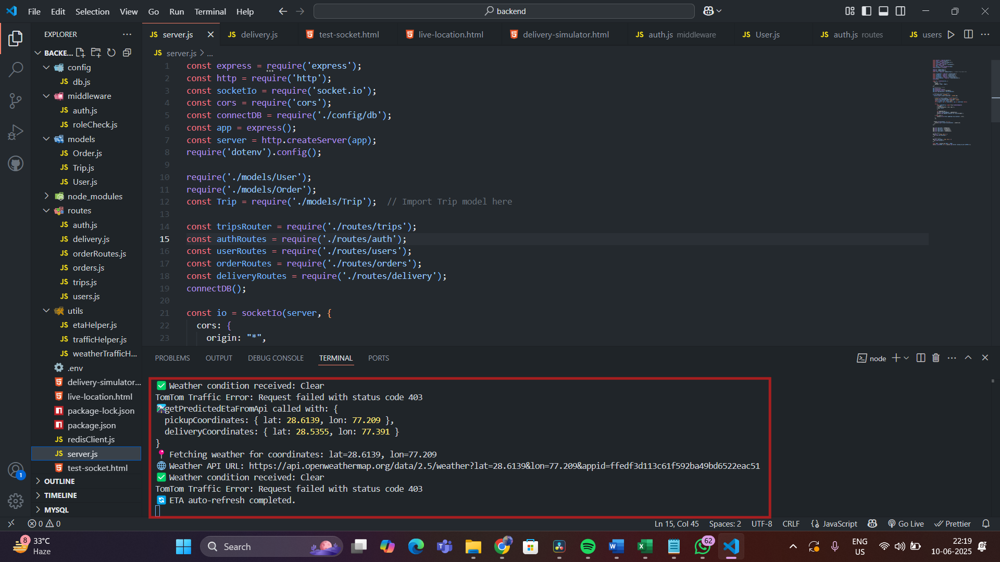

#  TrackNex: Real-Time Delivery Tracking System

An AI-powered real-time delivery tracking system that enables customers, delivery agents, and logistics managers to view live delivery status, accurate ETAs, and role-based dashboards.
Developed for the Cyfuture AI Hackathon to address the problem statement:
"Build an AI system to provide accurate, real-time tracking updates for customers and logistics managers."


## ✨ Features

**✅ Completed**

📍 Real-Time Location Tracking – WebSocket-powered live delivery updates on map

🧠 AI-Powered ETA Prediction – Trained Random Forest model with R² ≈ 0.99

👤 Role-Based Dashboards – Separate views for Customer, Delivery Agent, and Manager

🔐 Secure Authentication – JWT-based login system

📦 Order & Trip Management – Create, assign, start, update, and complete deliveries

🗂️ Delivery Assignment System – Manager-driven order allocation

🌦️ Traffic & Weather API Integration – Enhanced ETA accuracy using TomTom & OpenWeather

🌐 RESTful API Layer – Clean, modular Express.js backend with Redis caching

⚙️ ML Model Integration – Real-time ETA via dedicated ML API (Python + Flask)

🧩 Scalable Architecture – Modular separation: Frontend (Vercel), Backend (Render), ML Model (Render)

**🚧 In Progress / Upcoming**

📊 Analytics & Reporting Dashboard – Visual insights for managers

⭐ Ratings & Feedback System – Post-delivery experience logging

💳 Dummy Payment API Integration – Simulated checkout process

🔔 Notification System – Email/SMS alerts for delays, dispatch, delivery

🧠 Route Optimization Engine – Integrating dynamic re-routing logic
## 🧱 Project Structure

This project is modularly divided into three independently deployable components:

**🖥️ Frontend (/frontend)**

Built using Next.js 15, Tailwind CSS, and TypeScript

Implements role-based dashboards (Customer, Delivery Agent, Manager)

Integrated Maplibre GL for live delivery tracking

Smooth, animated UI with Framer Motion, Lucide Icons, and Radix UI

Handles API consumption and user session management using Axios and JWT Decode

**⚙️ Backend (/backend)**
Developed with Node.js, Express.js, and MongoDB (Mongoose)

Implements JWT authentication and role-based access control

Exposes REST APIs for:

📦 Order & trip lifecycle management

🗂️ Delivery assignment & tracking

🔗 ML model integration via HTTP

WebSocket integration using Socket.io for real-time location sharing

Redis used for caching and performance optimization

Deployed independently on Render

**🤖 ML Model (/ml_model)**
Developed in Python using Flask

Trained a Random Forest Regressor on 15,000+ delivery data points

Data pipeline:

Generated routes via ChatGPT

Enriched with TomTom & OpenWeather APIs

Introduced realistic noise for model robustness

Outputs real-time ETA predictions consumed by backend

Deployed as a microservice on Render
## 🛠️ Tech Stack

**🖥️ Frontend**

Framework: Next.js 15, React 19

Styling: Tailwind CSS, Tailwind Merge, Tailwindcss Animate

UI: Lucide React Icons, Radix UI, Framer Motion

Utilities: Axios, Clsx, Class Variance Authority, JWT Decode

Map Rendering: Maplibre GL

Dev Tools: TypeScript, ESLint, PostCSS, Autoprefixer

**⚙️ Backend**

Server: Node.js, Express.js

Database: MongoDB with Mongoose

Auth: JWT, BcryptJS

APIs & Requests: Axios, CORS, Dotenv

Real-time: Socket.io for WebSocket communication

Cache Layer: Redis

**🤖 Machine Learning**
Language & Frameworks: Python, Flask

Libraries: Scikit-learn, Pandas, NumPy

Model: Random Forest Regressor (trained on 15k+ enriched data points)

Data Prep:

Route generation using ChatGPT

Feature enrichment via TomTom and OpenWeather APIs

Noise introduction and scaling for realism

Performance: R² Score ≈ 0.99

**🌐 Deployment**

Frontend: Vercel

Backend: Render

ML Model API: Render
## 📸 Screenshots

#### 🏠 Homepage  


#### 🔐 Auth Page (Login)  


#### 📦 Manager Dashboard – Orders Tab (Functional)  
*Only the "Orders" tab is fully functional. Other sections are UI dummies for now.*  


#### 🤖 ML Model API Test (ETA Prediction)  
*Response from live deployed ML model via Postman/browser.*  


#### 📟 Backend – Live Logs or API Response  
*Real-time logs showcasing WebSocket/API activity (optional dev insight).*  


## 🛠️ Run Locally
Follow the steps below to run all components of the project locally.

**📦 Clone the Repository**
```bash
  git clone https://github.com/saurabhhmishhra/delivery-tracking.git
  cd delivery-tracking
```
**⚙️ Start Backend Server**

```bash
  cd backend
  npm install
```
Create a .env file in the backend directory with the following variables:
```bash 
  MONGO_URI=your_mongodb_uri  
  JWT_SECRET=your_jwt_secret  
  REDIS_URL=your_redis_url  #Optional  
```
Start the server
```bash
  node server.js
```
**🤖 Start ML Model Server**
```bash
  cd ml_model
  pip install -r requirements.txt
  python ml_api.py
```
    Make sure the ML API is accessible at a public URL or from your local backend.

**🖥️ Start Frontend**

```bash
  cd frontend
  npm install
  npm run dev
```
    ⚠️ Set up .env.local in the frontend directory if API URLs need to be customized.

Everything should now be running on:

Frontend: http://localhost:3000

Backend: http://localhost:5000

ML Model: http://localhost:8000
## 🌱 Environment Variables
You need to set the following environment variables in each component's root directory:

**🔐 Backend (/backend)**
Create a .env file with:


```
MONGO_URI=your_mongodb_uri
JWT_SECRET=your_jwt_secret
REDIS_URL=your_redis_url # Optional
```
**🤖 ML Model (/ml_model)**
If applicable, set any required API keys or secrets here (e.g., weather or traffic APIs):
```
WEATHER_API_KEY=your_weather_api_key
TRAFFIC_API_KEY=your_traffic_api_key
```
**🖥️ Frontend (/frontend)**
Create a .env.local file with:
```
NEXT_PUBLIC_BACKEND_URL=http://localhost:5000
NEXT_PUBLIC_ML_API_URL=http://localhost:8000
```
    🔁 Adjust the URLs if you're using deployed versions on Render or Vercel.

## 📡 API Reference

📌 API documentation will be added once all endpoints are finalized.  
(Planned for Phase 2 of the hackathon)

## 🌐 Deployment
All three core components are deployed on modern cloud platforms:

- 🖥️ Frontend (Next.js)
  - Platform: Vercel
  - URL: https://delivery-tracking-saurabhhmishhras-projects.vercel.app/

- ⚙️ Backend (Node.js + Express)
  - Platform: Render
  - URL: https://delivery-tracking-backend-3mxb.onrender.com

- 🤖 ML Model API (Python + Flask)
  - Platform: Render
  - URL: https://delivery-tracking-2xva.onrender.com


## 🚧 Roadmap

#### ✅ Phase 1 – Initial Hackathon Round (Completed)
- [x] Backend APIs (Orders, Trips, Auth)
- [x] ML Model for ETA Prediction
- [x] ML API Deployment
- [x] Frontend Homepage
- [x] Authentication Pages with Backend Integration
- [x] Manager Dashboard UI (Partially Functional – Orders only)

#### ⏳ Phase 2 – Final Hackathon Round
- [ ] Full Functionality in Manager Dashboard (Trips, Ratings, Live Map, ETA)
- [ ] Functional Customer & Delivery Agent Dashboards
- [ ] Analytics & Reporting Dashboard
- [ ] Notification System (delays, weather alerts)
- [ ] Ratings & Feedback System
- [ ] Route Optimization via ML

#### 🛠️ Future Enhancements
- [ ] 🗣️ **Voice Agent Integration** using **Vapi + Gemini**  
      → Multilingual, human-like responses to queries like:  
      “Where is my order?”, “What’s the traffic like?”, etc.

- [ ] 💬 Real-Time Chat Between Customer & Agent

- [ ] 📱 **React Native Mobile App**  
      → Cross-platform app for Customers, Agents & Managers

- [ ] 🖥️ **Desktop Application**  
      → Electron-based admin dashboard for logistics managers
## 👤 Author

**Saurabh Mishra**  
🚀 Full Stack Developer | AI Enthusiast | Hackathon Builder  
📫 [LinkedIn](https://www.linkedin.com/in/saurabh-mishra-4a6788216/) • [GitHub](https://github.com/saurabhhmishhra)

**Yashi Tiwari**  
🚀 Full Stack Developer | AI Enthusiast | Hackathon Builder  
📫 [LinkedIn](https://www.linkedin.com/in/yashi-tiwari-b437b6293/) • [GitHub](https://github.com/yashitiwary)
## 🙏 Acknowledgements

- **Cyfuture AI Hackathon** – for the opportunity and platform to innovate
- **OpenAI & ChatGPT** – for dataset generation, architecture guidance, and debugging help
- **TomTom & OpenWeather APIs** – for enriching delivery route and environmental data
- **Vercel & Render** – for deployment support
- **readme.so** – for simplifying README creation
## 🤝 Contributing

Contributions are welcome and appreciated!

If you have suggestions, bug reports, or want to add new features:

1. Fork the repository  
2. Create a new branch (`git checkout -b feature/your-feature-name`)  
3. Commit your changes (`git commit -m 'Add some feature'`)  
4. Push to the branch (`git push origin feature/your-feature-name`)  
5. Open a Pull Request

Please ensure your code adheres to the existing style and includes relevant documentation.
## 📄 License

This project is licensed under the **MIT License**.  
See the [LICENSE](./LICENSE) file for more information.
